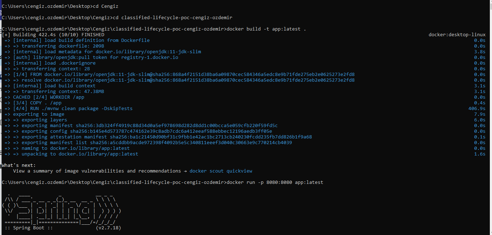

Merhabalar,

Test case için istenilen POC (demo) uygulamasını tamamladım ve belirlenen tüm gereksinimleri karşıladığımı düşünüyorum.

Uygulamaya Redis, Kafka, Elasticsearch gibi eklentiler ekleyebilirdim; ancak, test edilebilirliğini ön planda tutarak bu tür eklemeler yapmadım. Demo uygulaması olması nedeniyle, kurgusal olarak derinlemesine analiz çalışmaları yapmadım. Ancak, uygulama kurgusal olarak tüm istekleri karşılamakta olup, performans açısından da dikkatlice geliştirilmiştir.
Uygulamanın geliştirilebilirliğini artırmak ve kod okunabilirliğini sağlamak için bazı bölümleri özelleştirdim. (customize)

İlan uygulamasının sunduğu yetkinlikler:
- Emlak, vasıta ve alışveriş ilanlarının girilmesi
- İlanların kategori bazında sorgulanabilmesi
- İlan durumlarının takip edilmesi
- İlan görüntülenme sayılarının izlenmesi
- Kategori bazlı ilan raporları: aktif, pasif, onay bekleyen, mukerrer ilanlar
- Kategori bazlı ilanların aktif/pasif olarak listelenmesi
- Favori ilanların oluşturulması ve listelenmesi

Teknik yetkinlikler
- Katmanlı mimari ve SOLID prensiplerine uygun olarak geliştirilmiş
- Uygulamada bir çok Design Pattern kullanımına dikkat ettim. (Singleton Pattern, Decorator Pattern, Factory Pattern, Observer Pattern gibi)
- Uygulamanın containerize edilmesi sağladı.
  (docker build -t app:latest .
  docker run -p 8080:8080 app:latest)
- Java 11 - Spring boot 2.7.18 versiyonları kullanıldı.
- Çalışma süresi 5 milisaniyeden fazla süren isteklerin her defasında loglanması sağlandı.(aop)
- Unit testler yazıldı.
- Entegrasyon testleri yazıldı.
- Swagger entegrasyonu (http://localhost:8080/swagger-ui/index.html#)
- H2 veritabanı entegrasyonu (http://localhost:8080/h2-console/login.jsp?jsessionid=0bb19aaffa5ea6c16e19c37a00f4e0be) (sa/password)
- İndeks ve ilişkisel veritabanı yönetimi
- Custom validation
- Custom RestResponse
- Custom RuleEngine
- Global hata yönetimi (CustomException ve GlobalHandleException)
- MapStruct kullanımı
- Aspect-Oriented Programming (AOP) uygulandı
- Method Query, JPA Query kullanımı
- Custom Bean ile dependency injection kullanımı

Uygulama, gerekli tüm işlevleri yerine getirecek şekilde tasarlanmış ve performans açısından optimize edilmiştir. Başka bir sorunuz olursa, yardımcı olmaktan memnuniyet duyarım. 

İyi çalışmalar dilerim.

Cengiz ÖZDEMİR

Uygulama containerize edilmesi

